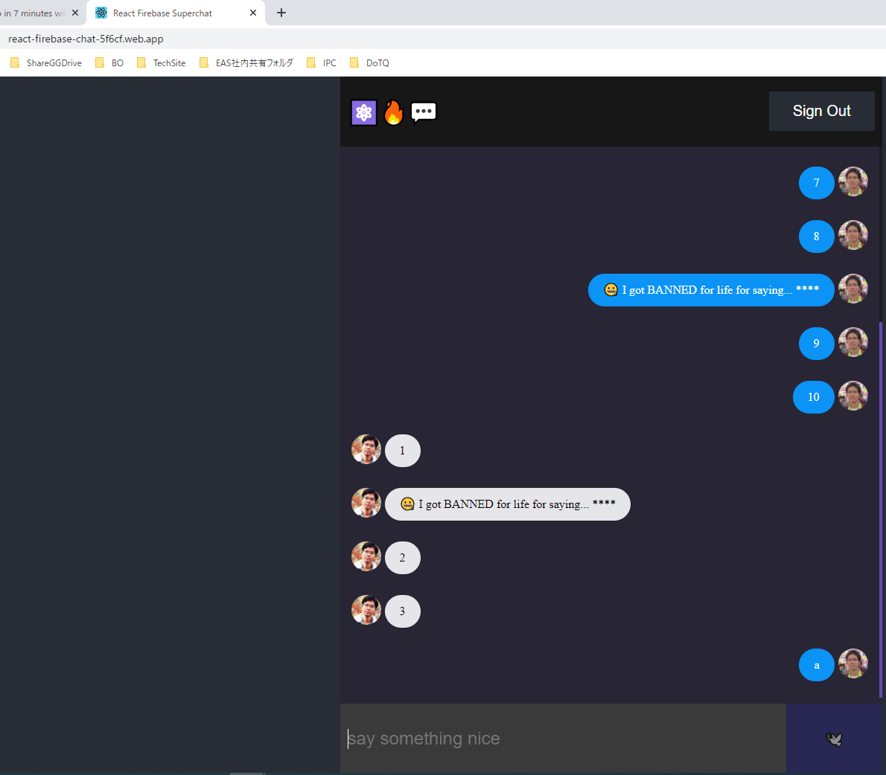
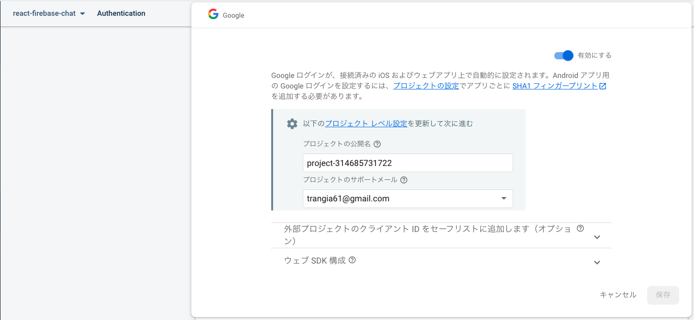
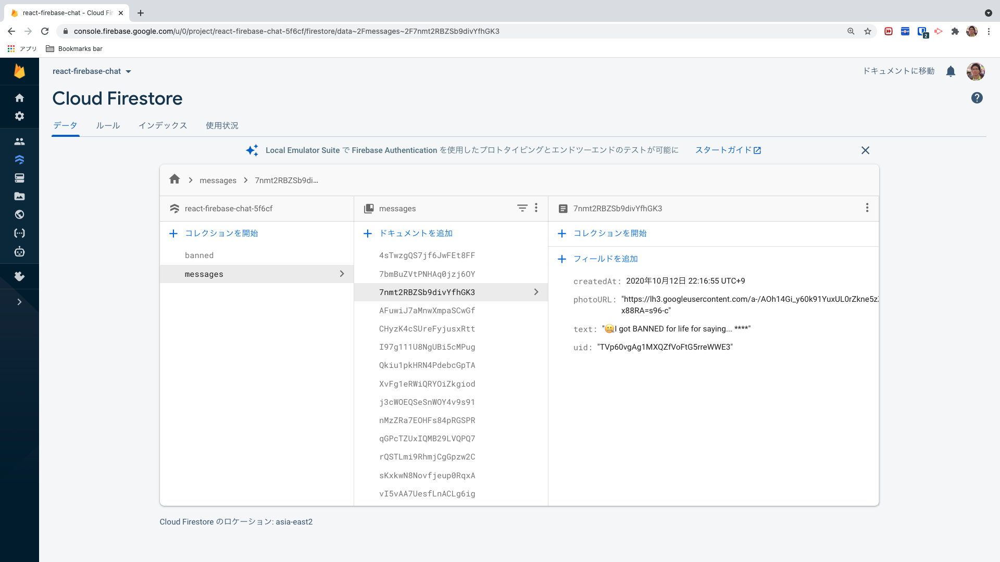
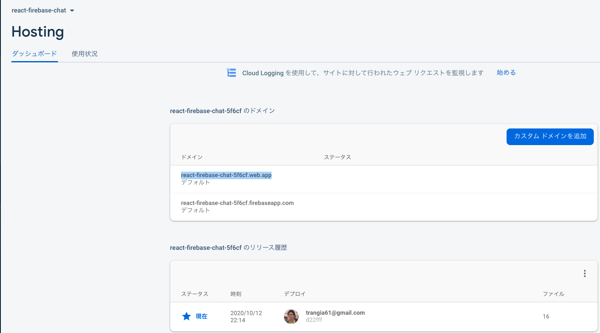
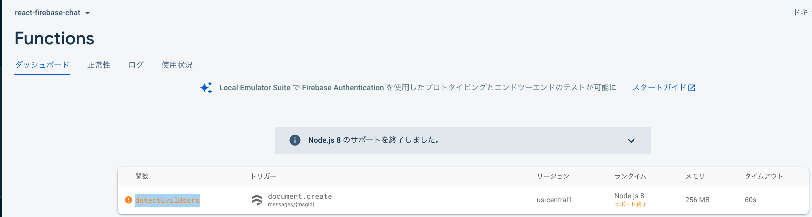
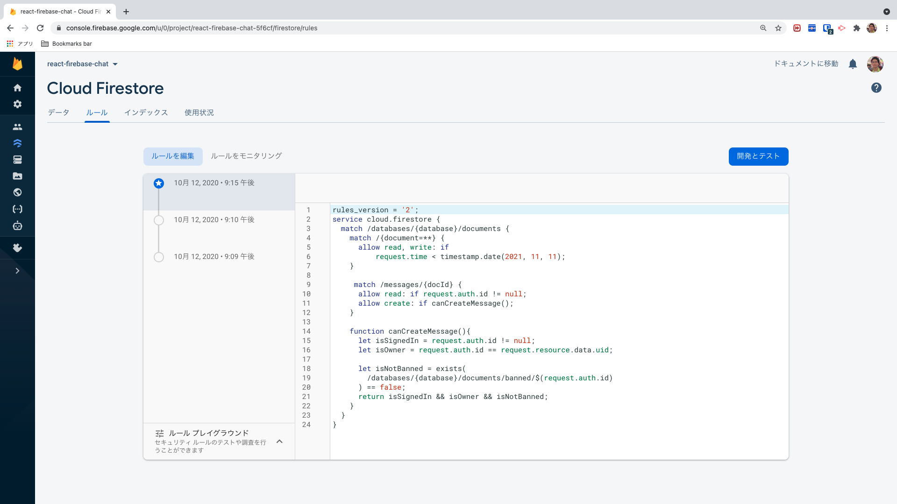

# react-firebase-chat-ban-badwords 🚀

[](https://github.com/tquangdo/react-firebase-chat-ban-badwords/issues/new)


## FB
### authentication

### db

### hosting

### function


## chat-ban-badwords
### result at present
1. auto change bardwords into `🤐 I got BANNED for life for saying... ****` **=> OK**
2. ban user for creating msg **=> NG**
### src code
https://github.com/tquangdo/react-firebase-chat-ban-badwords/blob/main/functions/index.js#L8
### db rule
FB > Cloud Filestore > Security rules:
```js
    function canCreateMessage(){
    	let isSignedIn = request.auth.id != null;
      let isOwner = request.auth.id == request.resource.data.uid;
      
      let isNotBanned = exists(
      	/databases/{database}/documents/banned/$(request.auth.id)
      ) == false;
      return isSignedIn && isOwner && isNotBanned;
    }
```

